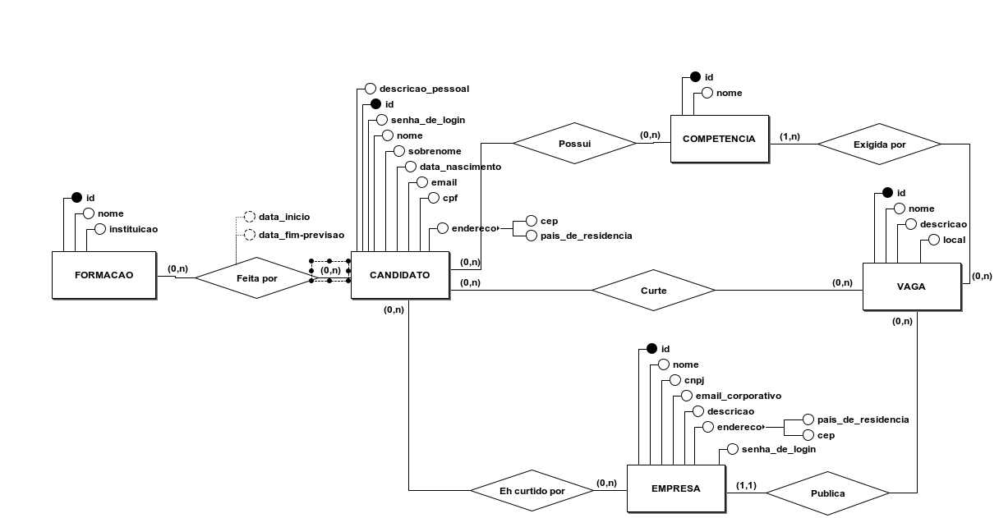

# Linketinder

## Descrição
Este projeto é um sistema simples desenvolvido em Groovy para gerenciar candidatos, empresas e vagas. Ele permite listar candidatos, empresas e vagas cadastradas, além de possibilitar interações como "curtidas" entre candidatos e empresas, por meio de um menu interativo no terminal.

## Tecnologias Utilizadas
- **Linguagem:** Groovy
- **Paradigma:** Orientação a Objetos
- **Banco de Dados:** PostgreSQL

## Estrutura do Projeto
O projeto é dividido em três camadas principais:

### 1. **Controller**
- `MainController.groovy`: Controla a interação do usuário com o sistema e gerencia o fluxo do programa.

### 2. **Model**
- `Pessoa.groovy`: Classe abstrata que representa uma pessoa.
- `Candidato.groovy`: Representa um candidato com informações como nome, email, CPF, idade, estado, CEP, descrição e competências.
- `Empresa.groovy`: Representa uma empresa com informações como nome, email, CNPJ, país, estado, CEP, descrição e competências.
- `Dados.groovy`: Armazena dados fictícios de candidatos e empresas.
- `PessoaInterface.groovy`: Interface para garantir a implementação dos métodos `getNome()` e `getEmail()`.

### 3. **View**
- `MenuView.groovy`: Gerencia a interface do usuário, exibindo o menu e as listas de candidatos e empresas.

## Modelagem do Banco de Dados

### Modelo Entidade-Relacionamento (MER)


### Modelo Lógico (ML)


### Modelo Físico (MF)
O banco de dados foi implementado com base no modelo físico abaixo:

[Modelo Físico](docs/dataBase/Modelo_Físico_LinkeTinder.sql)

### Principais Tabelas
- **CANDIDATO:** Armazena informações sobre os candidatos, como nome, sobrenome, data de nascimento, email, CPF, descrição pessoal, endereço e competências.
- **EMPRESA:** Armazena informações sobre as empresas, como nome, CNPJ, email corporativo, descrição e endereço.
- **VAGA:** Armazena informações sobre as vagas de emprego, como nome, descrição, local e empresa responsável.
- **COMPETENCIA:** Lista as competências que podem ser associadas a candidatos e exigidas por vagas.
- **FORMACAO:** Armazena informações sobre formações acadêmicas ou profissionais dos candidatos.
- **Tabelas Associativas:** 
  - `CANDIDATO_CURTE_VAGA`: Relaciona candidatos que curtiram vagas.
  - `EMPRESA_CURTE_CANDIDATO`: Relaciona empresas que curtiram candidatos.
  - `CANDIDATO_COMPETENCIA`: Relaciona candidatos com suas competências.
  - `VAGA_COMPETENCIA`: Relaciona vagas com as competências exigidas.
  - `FORMACAO_CANDIDATO`: Relaciona candidatos com suas formações.


## Como Executar
### Requisitos
- **Java 17**
- **Groovy 4.0.14**

### Passos
1. Clone este repositório:
   ```sh
   git clone https://github.com/Julielison/Linketinder-Project.git
   cd Linketinder-Project/backend/src
   ```
2. Execute o sistema com o seguinte comando:
   ```sh
   groovy Main.groovy
   ```

## Funcionalidades
- Listagem de candidatos cadastrados.
- Listagem de empresas cadastradas.
- Interação via terminal com menu interativo.

## Exemplo de Uso
```sh
=== Menu ===
1. Listar Candidatos
2. Listar Empresas
3. Sair
Escolha uma opção: 1

--- Lista de Candidatos ---
Candidato: Carlos Silva | Email: carlos@gmail.com | CPF: 12345678900 | Idade: 30 | Estado: SP | CEP: 01000-000 | Descrição: Desenvolvedor Full Stack | Competências: Java, Spring, Angular
...
```

## Devs
- Julielison Lima
